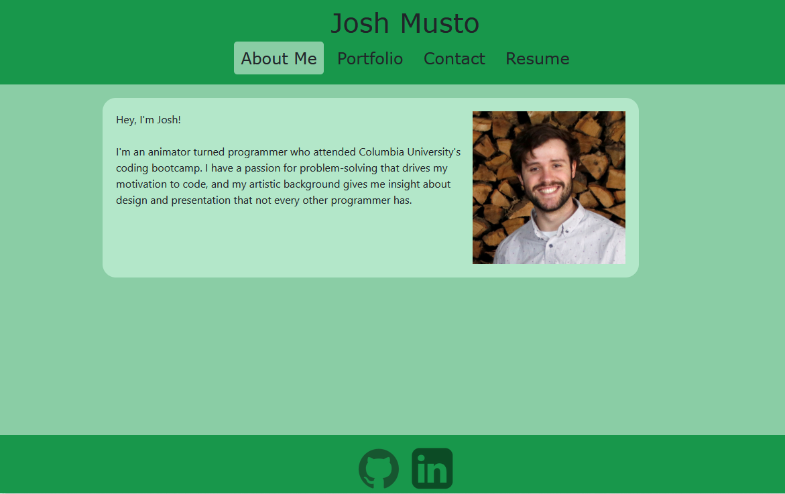

# React Portfolio

## Description

A portfolio site built using React. The site contains an About Me section, an easily-accessible portfolio, a simple contact form, and a built-in resume with accompanying downloadable version.

## Table of Contents

- [Usage](#usage)
- [Credits](#credits)
- [Contribution](#contribution)
- [Questions](#questions)

## Usage

 

## Credits

This site was primarily built with React.

## Contribution

Currently, this is a solo developer project.

## Questions

Any questions about this software can be directed to the author via
Github: https://github.com/joshmusto